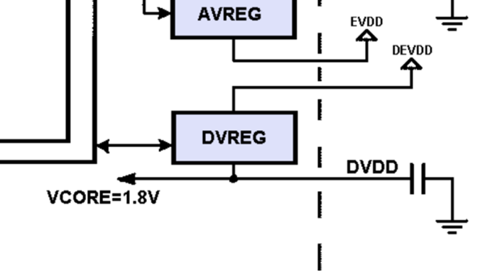
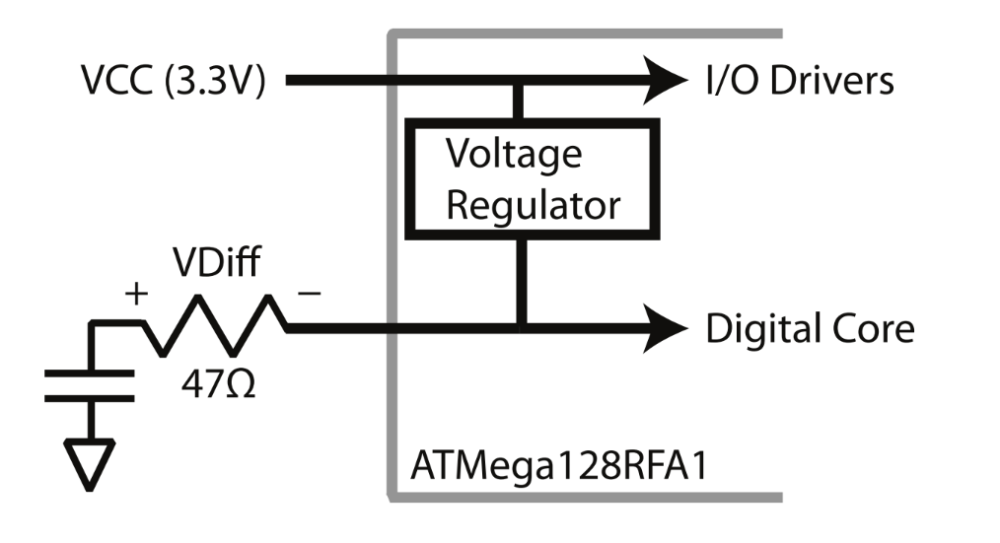

# Targets with Internal Regulators

Many devices will have an internal voltage regulator - for example the following excerpt from the ATMega128RFA1 datasheet shows a 3.3V input being regulated by an internal voltage regulator:

This may seem to be a problem for performing side-channel power analysis. Some devices have a way to shut down the internal regulator (either via programming, or via an external pin).

## Using Internal Voltage Regulator
There is two possible ways around this: inserting a shunt into the capacitor, or "overpowering" the internal regulator such that it shuts down. The first way means simply using a shunt resistor as shown below, where we measure from the negative side of the "VDIFF" shown here:

Note on certain devices there may be a large low-frequency noise from the internal regulator. You can improve the results in those cases by:

* Using a high-pass external filter.
* Using a differential probe.
* Using the external voltage regulator connection (shown below).

## Using External Voltage Regulator
Alternatively, we can send in a "slightly" higher internal voltage. The internal voltage regulator should see the feedback voltage is above the target voltage, and thus will not pass any voltage. The result is a lower-noise signal. This looks as follows:

You may need some experimentation to determine the ideal voltage input. You don't want it too high or the magic smoke may be released, but if it's too low the internal voltage regulator will kick in causing additional noise.

On the CW308 UFO board this is easily done by moving J14 to the right side (connecting VADJ to the filter input), and adjusting VADJ as appropriate. Before doing this though you should **preset VADJ to an appropriate value** (i.e., ensure using a DMM the voltage is set to around 1.2V if using a 1.2V core).

Due to the potential for significant damage, it's suggested to always set VADJ back to the lowest level once done with a target.

